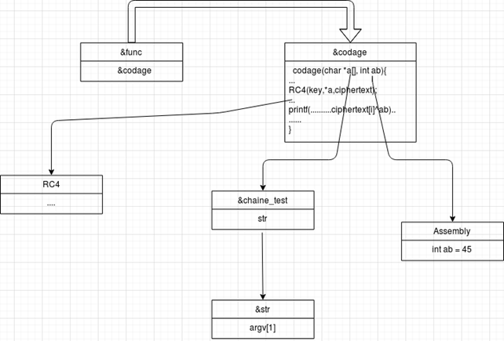

# VIROLOGIE INFORMATIQUE
# INSA Centre Val De Loire - DINH THANH HAI & NGUYEN ANH NGUYEN
# PARTIE CHIFFREMENT

```C++
 Notre programme est ECHO
``` 

## La construction de notre malware ‘echo’


Nous avons utilisé des pointeurs, des fonctions cachés et l’algorithme symétrique RC4 avec une clé pour cacher nos codes et la chaîne entrée argv[1] et le brouillage de l’information. Nous allons décrire notre structure par des étapes au dessous.


1. On stocke la chaîne entrée argv[1] dans une variable **char str [80]** grâce à la commande **sprintf** au début.
Ensuite, on définit un pointeur en type char* et le donner une espace dans la mémoire par ‘malloc’ et on utilise ce pointeur à indiquer vers à **str**.

```C++
char str[80];
sprintf(str, "%S", argv[1]);
char *chaine_test = NULL;
chaine_test = (char *)malloc(strlen(str)*sizeof(char));
chaine_test = str;
```

2. On intègre des codes assembleurs pour générer une variable de clé xor. On choisit 45 est la clé.
Dans la structure des codes assembleurs, on a créé une variable qui est égale à 1 et après des boucles on compte plus 1 pour cette variable jusqu’à 45 et on va sortir la boucle. On a fait comme ça pour bien cacher notre génération de variable:

```C++
int ab;
__asm{
    mov ab, 1; 
    mov eax, ab; 
boucle:	
	mov ab, eax; 
	cmp eax, 45;
	je fin;
	inc eax;
	mov ab,eax;
	jmp boucle
fin:
	mov ecx,12;
}
```

3. On crée une fonction codage avec deux paramètres en type *char*[]* et int:

```C++   
void codage(char *a[],int ab){
	
	char *p = (char *)strcpy;
	type_fonction fonc2 = (type_fonction)(p+405428);
	int len = strlen(*a);
	
	char key[] = "AnguyenHaiThanh44973597";
	unsigned char *ciphertext = (unsigned char *)malloc(sizeof(int) * strlen(*a));
	
	RC4(key, *a, ciphertext);
	
	for(size_t i = 0, len = strlen(*a); i < len; i++){
		fonc2("'\\x%02hhX' ", ciphertext[i]^ab);
	}

	MessageBox(NULL, TEXT("Hello Flavien ^_^"), TEXT("VIRUS VIRUS"), MB_OK);
}
```

Dans cette fonction, on a fait deux choses pour bien cacher la commande **printf** et chiffrer la chaîne entrée par l’algorithme RC4 et XOR.

 * Pour cacher la commande **printf** : On trouve la différence entre deux commandes ‘strcpy’ et ‘printf’ qui est égale à **405428 octet**. Donc on a utilisé la commande **strcpy** à cacher la commande ‘printf’ comme au dessous:

```C++
 char *p = (char *)strcpy;
 type_fonction fonc2 = (type_fonction)(p+405428);
 int len = strlen(*a);
 ```

 * On chiffre la chaîne entrée avec l’algorithme RC4 avec la clé ***AnguyenHaiThanh44973597*** et puis, fait ‘XOR’ la chaîne chiffré avec le numéro de **xor 45** . Enfin, on sort le résultat sur le terminal par la commande d’affichage **fonc2** qui est définit au-dessus:
 
 ```C++
 char key[] = "AnguyenHaiThanh44973597";
 unsigned char *ciphertext = (unsigned char *)malloc(sizeof(int) * strlen(*a));
 RC4(key, *a, ciphertext);
	
 for(size_t i = 0, len = strlen(*a); i < len; i++){
	fonc2("'\\x%02hhX' ", ciphertext[i]^ab);
 }
 MessageBox(NULL, TEXT("Hello Flavien ^_^"), TEXT("VIRUS VIRUS"), MB_OK);
```

4. Ici on met la structure l’algorithme RC4 par des fonctions ensuite que on a définit:

```C++
#define N 256 // 2^8


void swap(unsigned char *a, unsigned char *b) {
 int tmp = *a;
 *a = *b;
 *b = tmp;
}

int KSA(char *key, unsigned char *S) {

 int len = strlen(key);
 int j = 0;

 for(int i = 0; i < N; i++)
 S[i] = i;

 for(int i = 0; i < N; i++) {
 j = (j + S[i] + key[i % len]) % N;

 swap(&S[i], &S[j]);
 }

 return 0;
}

int PRGA(unsigned char *S, char *plaintext, unsigned char *ciphertext) {

 int i = 0;
 int j = 0;

 for(size_t n = 0, len = strlen(plaintext); n < len; n++) {
 i = (i + 1) % N;
 j = (j + S[i]) % N;

 swap(&S[i], &S[j]);
 int rnd = S[(S[i] + S[j]) % N];

 ciphertext[n] = rnd ^ plaintext[n];

 }

 return 0;
}

int RC4(char *key, char *plaintext, unsigned char *ciphertext) {

 unsigned char S[N];
 KSA(key, S);

 PRGA(S, plaintext, ciphertext);

 return 0;
}
```

5. Pour bien cacher l’appel fonction ‘codage’ dans le main. On définit un type fonction **function_render** qui contient deux paramètres en type **(char ** et int)**:
* char **  est un pointeur en niveau 2 qui contient l’adresse de chaîne (char*) indiquée.
* int est le numéro pour ‘xor’ avec chaque caractère de la chaîne entrée pour éviter d’appeler directement la fonction **codage** grâce à fonction_render:

```C++
function_render func = (function_render) (codage);
```

6. Diagramme pour bien décrire notre structure: 



