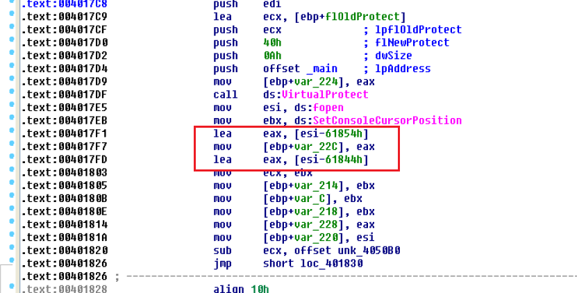

# VIROLOGIE INFORMATIQUE
# INSA Centre Val De Loire - DINH THANH HAI & NGUYEN ANH NGUYEN
# ANALYSER LE PROGRAMME DE TYPE "ECHO" DE GROUPE: ANDRO DADIC & FLAVIEN EHRET

## 0. Tables adresses hex des fonctions dans le code

| Fonction                   | Adresse  |
|----------------------------|----------|
| IsDebuggerPresent          | 7c82f6ef |
| CheckRemoteDebuggerPresent | 7c85b690 |
| sctrcpy                    | 78aa2700 |
| SetConsoleCursorPosition   | 7c875ab2 |
| fopen                      | 78b03f54 |
| printf                     | 78b056b4 |
| VirtualProtect             | 7c801ad4 |
| GetCurrentProcess          | 7c80de95 |
| strcat                     | 78aa2710 |

## 1. Echo ou Pas

 Après qu'on a étudié dans la structure par l'IDA, on constate que ce programme est totalement un type de "echo".

 L'adresse de la fonction qui imprime est **0x401B01**.

 
 **Figure 1.** -  call esi : on appelle la fonction "printf" 

 ## 2. Chiffrement

 Dans la structure, la fonction qui chiffre la texte est **sub_4011D0**. Cette fonction reçoit 2 paramètres: 1ère est le ciphertext, 2ème est la clé.

 ```C
 String sub_4011D0(char ciphertext, char cle){}
 ``` 
 
 

  La clé de chiffrement initialement (clé0) est **kiufrufgijnbhuyg**.

 En plus, il utilise **le XOR 55h** pour 8 caractères pour déchiffrer et chiffrer un text ( le but est de cacher la clé de chiffrement initialement).

 

  L'étape de chiffrement est comme ça:

  1. Au début, il a utilisé la clé0 pour chiffrer un texte qui est "ument" (*var_210*) par la fonction **sub_4011D0**. On reçoit un result **text_1**. Ce texte est très important. 
    


  2. De 0x401A2C à 0x401AB1, c'est des pièges. Ses résultats n'ont pas utilisé. Donc on m'en fou. 
   
   ```C
   .text:00401A2C                 lea     edx, [ebp+var_110]
    .text:00401A32                 push    offset a332?72ouq ; ">< 3' 32<?;7= ,2ou´+¢"
    .text:00401A37                 push    edx
    .text:00401A38                 lea     ecx, [ebp+var_210]
    .text:00401A3E                 call    sub_4011D0
    .text:00401A43                 add     esp, 10h
    .text:00401A46                 mov     ecx, 0
    .text:00401A4B                 xor     ecx, ecx
    .text:00401A4D                 xor     eax, eax
    .text:00401A4F                 lea     eax, a332?72ouq ; ">< 3' 32<?;7= ,2ou´+¢"
    .text:00401A55
    .text:00401A55 loc_401A55:                             ; CODE XREF: _main+2B1j
    .text:00401A55                 mov     bl, [eax]
    .text:00401A57                 xor     bl, 55h
    .text:00401A5A                 mov     [eax], bl
    .text:00401A5C                 inc     eax
    .text:00401A5D                 inc     ecx
    .text:00401A5E                 cmp     ecx, 8
    .text:00401A61                 jb      short loc_401A55
    .text:00401A63                 mov     ecx, 0
    .text:00401A68                 xor     eax, eax
    .text:00401A6A                 lea     eax, a332?72ouq+8
    .text:00401A70
    .text:00401A70 loc_401A70:                             ; CODE XREF: _main+2CCj
    .text:00401A70                 mov     bl, [eax]
    .text:00401A72                 xor     bl, 55h
    .text:00401A75                 mov     [eax], bl
    .text:00401A77                 inc     eax
    .text:00401A78                 inc     ecx
    .text:00401A79                 cmp     ecx, 8
    .text:00401A7C                 jb      short loc_401A70
    .text:00401A7E                 lea     eax, [ebp+var_110]
    .text:00401A84                 push    (offset a332?72ouq+8)
    .text:00401A89                 push    eax
    .text:00401A8A                 lea     ecx, [ebp+var_210]
    .text:00401A90                 call    sub_4011D0
    .text:00401A95                 add     esp, 8
    .text:00401A98                 mov     ecx, 0
    .text:00401A9D                 xor     eax, eax
    .text:00401A9F                 lea     eax, a332?72ouq+8
    .text:00401AA5
    .text:00401AA5 loc_401AA5:                             ; CODE XREF: _main+301j
    .text:00401AA5                 mov     bl, [eax]
    .text:00401AA7                 xor     bl, 55h
    .text:00401AAA                 mov     [eax], bl
    .text:00401AAC                 inc     eax
    .text:00401AAD                 inc     ecx
    .text:00401AAE                 cmp     ecx, 8
    .text:00401AB1                 jb      short loc_401AA5
   ```
    

3. De Ox401A5 à 0x401ACE, il est très important pour décider que ce programme est echo ou non. D'abord, dans le rectangle rouge, c'est la fonction **strcncpy** ( il copie 7 caractères de var_210 à var_C, d'ici, var_210 est **text_1 + XOR 55h**). Et après, dans la rectangle noir, il utilise le var_C pour comparer avec un text **aS_2Zgj**. Il est possible que si var_c == aS_2Zgj, il n'imprinte pas. 
   
   

 4. Mais après qu'avoir étudié la structure de 0x401AD1 à 0x401AEF, on voit que dans tous les cas, lorsque ce programme n'est pas echo, il faut sauter à l'étape loc_401AE5. Mais pour sauter, il faut que dl a la value 0, mais avec une ligne: ** mov dl, [eax+1] **, cela prouve qu'il ne saute jamais à l'étape loc_401AE5.

    

 ## 3. Anti-Debug

  Dans le code, il a utilisé 2 types de Anti-Debug: **IsDebuggerPresent** et **CheckRemoteDebuggerPresent**.

 * L'adresse de la fonction **IsDebuggerPresent** quand il est appelé est 0x4018D5.

  

  Quand l'IDA lance là-bas, l'adresse hex de pointeur [ebp+var_214] est ***0x7c82f6ef***. C'est exactement la fonction Anti-Debug **IsDebuggerPresent**. Et après ce ligne, on voit que:

  ```
  jnz loc_401B06
  ```

*loc_401B06* est utilisé contre Debug car c'est une boucle infinie.

 
 
 Sur la structure de cette fonction, je prédis que IsDebuggerPresent est écrit comme ça:

 ```C
 if(IsDebuggerPresent()){
     while(1);
 } else{
     \\\
 }
 ```

  Pour passer ce anti-debug, on change seulement de *jnz* à *jz* et dans le code, on cherche le *loc_401B06* et change le saut inverse ( mais pas du tout, par exemple, à 0x40161, il ne faut pas changer parce que à d'ici, il vérifie que si l'argv est inférieur que 0, il ne fonctionne pas).


 * L'adresse de la fonction **CheckRemoteDebuggerPresent** quand il est appelé est 0x40191F.
  
  
  
  D'ici, quand l'IDA lance, l'adresss à registre *esi* est ***7c85b690***. C'est exactement la fonction Anti-Debug **CheckRemoteDebuggerPresent**.
  Des lignes suivantes, on voit que:
  
   * Rectangle noir: Quelques points à noter: **fs:30**, mov eax. Exactement dans le code, il a une ligne :

      ```C
       ppeb = IsDebuggerPresent; // ppeb est la fonction IsDebuggerPresent 
	    __asm{
		    mov eax, fs:[0x30]; //ProcessEnvironmentBlock(documentation de Microsoft)
		    mov ppeb, eax 
	    }
      ```  
      Le but de rectangle noir est d'appelé la fonctionn Anti-Debug IsDebuggerPresent.

   * Rectangle rouge: Quelques points à noter: **[eax+2], [eax+68], 70h**. Exactement il a utilisé ppeb[2] et ppeb[104] & 0x70. 
  
  En général, la technique Anti-Debug est comme le TD, pas nouveau.


 ## 4. Auto-modification

 Dans la structure, il a utilisé la fonction **VirutalProtect** avec la taille **dwSize = 10** ( *push 0Ah*) et **flNewProtect = page_execute_readwrite** ( *push 40h*) . L'adresse de cette fonction est **0x4017DF** comme l'image ci-dessus. 

 

 En général, on prédit que dans la code, il y a une ligne :

 ```C
 char * pointeur = (char*) _tmain;
 VirutalProtect(pointeur, 10, PAGE_EXECUTE_READWRITE, lpflOldProtect);
 ```
  Le code n'a pas été caché. Il est appelé directement au début de code.

 ## 5. Obfuscation

  Des fonctions caché sont: **strcpy, strcat, IsDebuggerPresent, CheckRemoteDebuggerPresent, strncpy, printf**
  
 1. Il utilise la fonction **fopen** pour cacher 3 fonctions strcpy,  strcat et strncpy. 
  
```C
   strcat = fopen - 61844
   strcpy = fopen - 61854
``` 




 
 2. Il utilise la fonction **SetConsoleCursorPosition** pour cacher 2 fonctions Anti-debug IsDebuggerPresent et CheckRemoteDebuggerPresent. Autre que fopen, il utilise une autre fonction pour changer l'adresse de **SetConsoleCursorPosition** à **IsDebuggerPresent** et **CheckRemoteDebuggerPresent**

 

 Les values de soustractions sont **107554 bits ( pour le CheckRemoteDebuggerPresent) et 287683 bits ( pour le IsDebuggerPresent)**
 
 3. Il utilise la fonction **scanf** pour cacher la fonction printf.

 

  